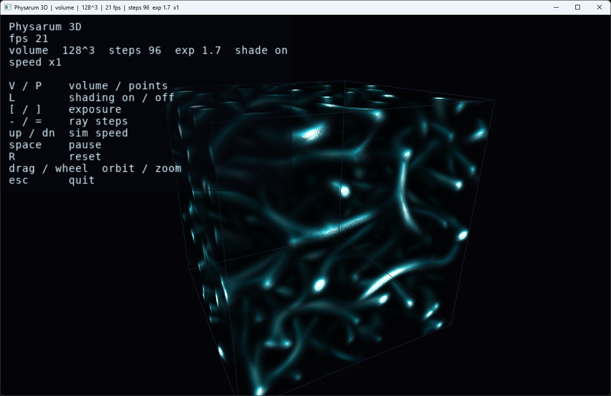

# Physarum 3D — Slime-Mould Networks

A real-time 3D simulation of *Physarum polycephalum* — the slime mould famous
for growing optimal transport networks — written from scratch in C++ with a
native Win32 + OpenGL viewer. Millions of agents lay down and follow a chemical
trail; out of three tiny local rules a living web of veins self-assembles and
fills the volume. The trail field is drawn with a **volumetric ray-marcher** so
you fly through a glowing 3D network, not a flat slice.

## Screenshot
  

## Highlights

- **Agent-based Physarum in 3D** (Jones' model) — each of ~1.2 million agents
  senses the trail ahead through a cone of sensors, steers toward the strongest
  scent, moves, and deposits a little trail. The field diffuses and decays, and
  reticulated transport networks emerge with no global planning.
- **Volumetric rendering** — the trail field is uploaded to a 3D texture every
  frame and ray-marched in a fragment shader with front-to-back compositing, a
  teal→cyan→white transfer function, auto-exposure, and **gradient-based
  shading** that turns the veins into lit 3D tubes. Ray-start jitter removes
  slice banding.
- **Points mode** — a fallback/compare view that draws the agents themselves as
  additive sprites.
- **Built for scale** — the field update and agent step run across all cores
  with a hand-rolled `std::thread` pool. The grid is toroidal, so networks wrap
  seamlessly and fill space.
- **On-screen HUD** — live FPS, current settings, and the key legend, drawn with
  an embedded bitmap font (no GDI, no external font files).
- **Zero dependencies** — links only `opengl32`, `gdi32`, `user32` from the
  Windows SDK. Modern GL entry points are resolved at runtime.

## Build & run

1. Open `PhysarumViewer.sln` in **Visual Studio 2022**.
2. Select **Release | x64**.
3. Make sure **PhysarumViewer** is the startup project (it is by default), then
   run with **Ctrl+F5** (Release — Debug is far too slow for ~1.2M agents plus a
   per-frame volume ray-march).

The solution holds two projects:

- **PhysarumViewer** — the interactive Win32/OpenGL viewer (this is what you run).
- **PhysarumVerify** — a small console app that runs the headless core checks
  described under [Verification](#verification). Right-click it → *Set as Startup
  Project* to run those instead, or use `build_verify.bat` (see below).

Run the viewer on a machine with real GPU drivers (OpenGL 3.3+); it will not work
over Remote Desktop. If Visual Studio reports the **v143** toolset is missing,
right-click the solution → *Retarget solution* and pick your installed toolset.

There is no CMake build here; the viewer is Windows-only by design (native
Win32 windowing + WGL context). The core itself is plain C++20 and also compiles
on Linux/macOS — see the build line in [Verification](#verification).

## Controls

| Input | Action |
| --- | --- |
| Left-drag | Orbit the camera |
| Mouse wheel | Zoom |
| `V` / `P` | Volume / points mode |
| `L` | Shading on / off (volume) |
| `[` / `]` | Exposure (volume) |
| `-` / `=` | Ray steps — quality vs. speed (volume) |
| `Space` | Pause / resume |
| `Up` / `Down` | Simulation speed (substeps per frame) |
| `H` | Hide / show the on-screen UI (clean view for screenshots) |
| `R` | Reset |
| `Esc` | Quit |

If the volume looks too dark or washed out, nudge exposure with `[` and `]`.
If it runs slowly, drop the ray-step count with `-` (default 96); integrated
GPUs prefer ~48–64, a discrete GPU handles 128–192 easily.

## How it works

### The agents

Each agent has a position and a heading in continuous 3D space. Every step it:

1. **Senses** the trail field at a small cone of points ahead (one forward
   sensor plus four around it).
2. **Steers** toward whichever sensor reads the strongest trail, with a little
   random wobble; if there's nothing to follow, it wanders.
3. **Moves** forward and wraps around the toroidal domain.
4. **Deposits** a fixed amount of trail at its new position.

After every agent has moved, the whole field is **diffused** (a separable
binomial blur) and **decayed** (multiplied by a factor < 1). Diffusion spreads
the scent so trails attract nearby agents; decay keeps strong, well-travelled
paths and lets unused ones fade. That feedback loop is the entire mechanism —
the optimal-looking network is emergent.

A note from building this: seeding the agents in a shell collapses everything to
a blob. Seeding them **uniformly through the volume** is what produces the
space-filling vein network.

### Rendering

The trail field is a `G³` scalar grid (default 128³). Each frame it's pushed to
a single-channel 3D texture and the viewer draws one fullscreen triangle; the
fragment shader reconstructs a camera ray per pixel, intersects it with the
domain box (slab test), and marches front-to-back accumulating colour and
opacity. Density drives a teal→cyan→white transfer function. Where the field is
dense enough, a central-difference gradient gives a surface normal and the
sample is lit (diffuse + rim), so the veins look like glossy tubes instead of
flat fog. Exposure auto-scales to the current field maximum.

## Verification

Because the renderer can't be unit-tested, the simulation core is validated
headless (`src/verify.cpp`): it tracks the field mean (must stay stable — the
network neither dies nor blows up), the coefficient of variation (rises as
structure forms), and the fraction of "hot" cells (sparse veins). During
development the 3D field was also projected to 2D (maximum-intensity
projection) to confirm visually that a connected network forms rather than a
blob.

**Run it** with either:

- Visual Studio — set **PhysarumVerify** as the startup project and press
  **Ctrl+F5**; or
- `build_verify.bat` from any command prompt (it finds the MSVC toolchain
  itself); or
- directly on any platform, since the core has no Windows dependencies:

  ```
  g++ -std=c++20 -O2 -pthread -Isrc src/verify.cpp src/physarum.cpp -o verify
  ```

A representative run (80³ grid, 400k agents):

```
    step   field mean   max     CV (structure)   hot%
      50      34.98      785.6     1.57           8.4
     100      35.16     1232.1     2.42           8.6
     150      35.16     1711.1     3.03           8.1
     200      35.16     2706.3     3.63           7.3
     250      35.16     3504.1     4.27           6.6
```

The field mean holds flat (deposit balances decay — the network is in steady
state), the CV climbs as veins sharpen against empty space, and only a single-
digit percentage of cells stay "hot": a thin reticulated network, exactly what
the model should produce.

## Tuning

The behaviour lives in `PhysarumParams` (`src/physarum.hpp`):

| Field | Meaning |
| --- | --- |
| `grid`, `agents` | Field resolution and agent count |
| `sensorAngle`, `sensorDist` | How wide and how far ahead agents look |
| `turnRate` | How hard they steer toward the trail |
| `stepSize` | Move distance per step |
| `deposit` | Trail dropped per agent per step |
| `decay` | Trail fade (lower = sharper, thinner veins) |

## Project layout

```
PhysarumViewer.sln       VS 2022 solution (both projects below)
PhysarumViewer.vcxproj   the interactive viewer
PhysarumVerify.vcxproj   the headless core check
build_verify.bat         build + run the core check without the IDE
src/
  vec3.hpp         3D vector maths
  mat4.hpp         matrices + orbit camera
  field3d.hpp      toroidal trail field (sample, deposit, diffuse+decay)
  physarum.hpp/.cpp agents: sense / steer / move / deposit, multi-threaded
  viewer_win32.cpp native Win32 + WGL viewer (volume ray-march, points, HUD)
  font_atlas.hpp   embedded bitmap font for the HUD
  verify.cpp       headless structure checks
```

## Technical notes

- **Native Win32 + WGL** — the window, input loop and GL context are all set up
  by hand; there is no GLFW/GLAD/GLEW. Modern GL functions are loaded at runtime
  via `wglGetProcAddress`.
- **C++20**, no third-party dependencies.
- The work scales across cores with a hand-rolled thread pool.

## License

See `LICENSE`.

## Support

If you found this project interesting or useful, you can support my work:

[](https://github.com/sponsors/makarov-mm)